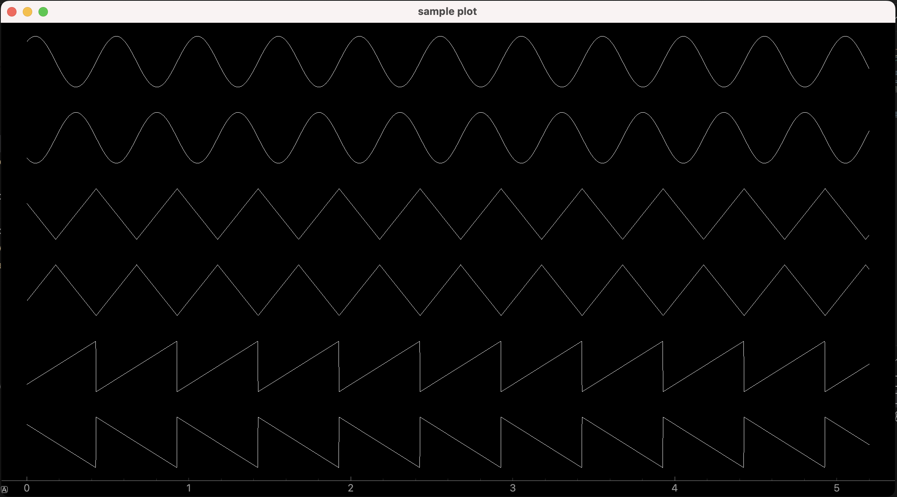

# IOIOpype
 IOIOpype is general purpose signal processing framework for realtime applications written in python. Data is proagated between Nodes that can be connected via Streams. Nodes can be input nodes 'INode', output nodes 'ONode' or input and output nodes 'IONode'. Algorithms and signal processing pipelines can be prototyped easily by combining multiple nodes.

## INodes
### General Purpose
- ConsoleLog - Writes received data to the console
- ToWorkspace - Propagates data to the main thread via event
- FramePlot - Plots a data frame
- SamplePlot - Plots time series data
- SpectrumPlot - Plots pwelch spectrum
- CSV Logger - Logs data to csv files
- UDP Receiver - Receives data via UDP

## IONodes
### General Purpose
- Buffer - Buffers data with a defined window size and overlap
- PWelch - Calculates a Pwelch spectrum from a frame
- Downsample - Samples a data frame down by a given factor
- OffsetCorrection - Removes the offset from a data frame
- ButterworthFilter - Applies a butterworth filter to a sample based signal
- ButterworthFiltFilt - Applies a butterworth filter to a frame as filtfilt
- ToSample - Slices and forwards a data frame into samples
- Log - Applies a logarithm to the input signal (ln, log10, 10*log10)
- Square - Squares the input signal
- Sqrt - Calculates the square root of the input signal
- Mux - Concatenates multiple signals into one
- Operation - Adds, Subtracts, Multiplies, Divides or applies a matrix multiplication
- Serialize - Serialized data into json or xml strings
- Deserialize - Deserializes XML or JSON serialized data
- Transpose - Transposes an input matrix
- GetRange - Gets a range of a matrix

### Heart Rate Variability
- LFHF - Calculates LF and HF power as well as ratios from a HRV spectrum
- Poincare - Arranges a given time window of RR data for a poincare plot

### IMU
- MovementDetector - Uses Accelerometer and Gyroscope inputs to detect movement
- ComplementaryFilter - Applies a complementary filter to estimate orientation of a IMU sensor (not finished yet)

## ONodes
### General Purpose
- Constant - forwards constant data with a defined sampling rate
- NoiseGenerator - Generates gaussian noise as a timeseries signal.
- SignalGenerator - Generates sample based timeseries signals. Sine, Square, Sawtooth and Triangle signals can be generated
- Frame - Allows to send a data frame to INodes
- UDPSender - Sends data via UDP

### Pulse Sensor
- BLEHeartRate - Pulse Sensor supporting default Bluetooth LE Heart Rate Service
- BLEHeartRateSimulator - Simulates a 'BLEHeartRate' device

## Supported platforms

| Windows    | Linux    | Mac  |
| :--------- |:---------| :----|

## Install ioiopype from PyPi

```pip install ioiopype```

## Acquisition and data visualization example

```python
import sys
import os

dir = os.path.dirname(os.path.abspath(__file__))
sys.path.append(os.path.dirname(dir))

from PySide6.QtWidgets import QApplication
import ioiopype as ioio

app = QApplication(sys.argv)

samplingRate = 500
channelCount = 2
sig1 = ioio.SignalGenerator(samplingRate, channelCount, ioio.SignalGenerator.SignalMode.Sine, 0.5, 2, 0)
sig2 = ioio.SignalGenerator(samplingRate, channelCount, ioio.SignalGenerator.SignalMode.Triangle, 0.5, 2, 0)
sig3 = ioio.SignalGenerator(samplingRate, channelCount, ioio.SignalGenerator.SignalMode.Sawtooth, 0.5, 2, 0)
mux = ioio.Mux(3)

#initialize processing nodes
numberOfChannels = len(mux.InputStreams) * channelCount
sp2 = ioio.SamplePlot(numberOfChannels, samplingRate, 5.2, 1.5, displayMode=ioio.SamplePlot.DisplayMode.Continous)

#build ioiopype
sig1.connect(0, mux.InputStreams[0])
sig2.connect(0, mux.InputStreams[1])
sig3.connect(0, mux.InputStreams[2])
mux.connect(0, sp2.InputStreams[0])

sig1.start()
sig2.start()
sig3.start()

app.exec()

sig1.stop()
sig2.stop()
sig3.stop()

#disconnect ioiopype
sig1.disconnect(0, mux.InputStreams[0])
sig2.disconnect(0, mux.InputStreams[1])
sig3.disconnect(0, mux.InputStreams[2])
mux.disconnect(0, sp2.InputStreams[0])
```



## Contact
Contact: ```mwalchsoferyt at gmail dot com```